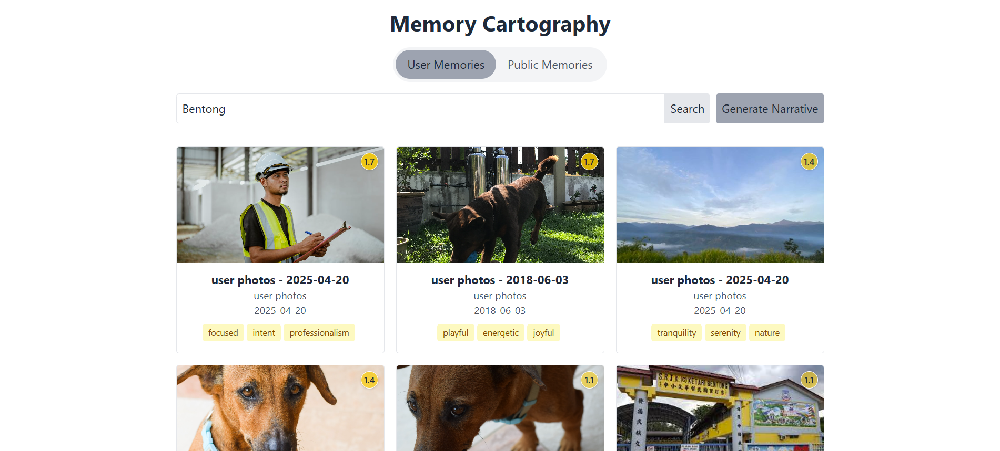
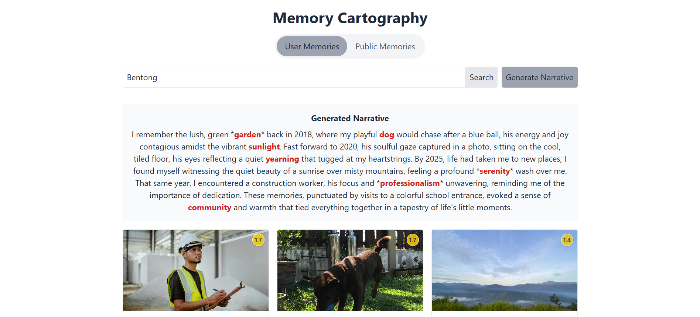

# Memory Cartography, Reimagining Space, Memory, and Identity 🗺️💭

**Author:** Chia Hui Yen  
**Mentor:** Professor Jimmy Cheng   
**Date:** 2025 Spring     




## 🌟 Project Overview

Memory Cartography is an innovative digital humanities project that explores the fluid, fragmented nature of spatial memory. Inspired by philosophers like Gaston Bachelard and Bernard Tschumi, this application challenges the traditional understanding of place as a static concept, instead revealing memory as a dynamic, deeply personal landscape.

## 🧭 Philosophical Foundations

At the intersection of phenomenology, digital humanities, and artificial intelligence, our project asks fundamental questions:
- How do personal memories of place evolve and transform over time?
- Can technology help us understand the subjective nature of spatial experience?
- What emerges when we map the intricate connections between personal and collective memories?

## ✨ Key Features

1. **Memory Cartography**
   - Semantic search across personal and public memory archives
   - AI-generated narrative compositions
   - Dynamic memory weighting and exploration

2. **Dual Memory Perspectives**
   - Personal Memory Collection
   - Public Memory Database
   - Seamless navigation between individual and collective experiences

3. **Innovative Interaction**
   - Contextual memory generation
   - Interactive memory prioritization
   - Multidimensional exploration of spatial narratives

## 🤖 Technical Architecture

### Core Technologies
- **Frontend**: React with TypeScript
- **Backend**: FastAPI (Python)
- **AI Integration**: OpenAI GPT for narrative generation
- **Semantic Processing**: scikit-learn embeddings

### Computational Methods
- Multimodal embedding
- Semantic similarity search
- Dynamic narrative generation

## 🔍 Methodological Approach

Drawing from interdisciplinary research in:
- Phenomenological philosophy
- Digital humanities
- Cognitive science
- Machine learning

## 🚀 Installation

### Prerequisites
- Node.js (v14+)
- Python (v3.8+)
- OpenAI API Key

### 🔧 Implementation Steps
1. Data Scraping
   Collect images for public and user photo databases:
   bashpython backend/scripts/pexels_scraper.py
   Images will be saved in:

   `backend/data/raw/public_photos`  
   `backend/data/raw/user_photos`

2. Data Processing
   Prepare and process the collected images:
   ```
   python backend/scripts/process_data.py
   ```

3. Run the Application
   Start the backend server:
   ```
   cd backend
   uvicorn app.main:app --reload
   ```
   In a new terminal, start the frontend:
   ```
   cd frontend
   npm install
   npm start
   ```

## 🌈 Potential Applications

1. **Experiential Research**
   - Cultural memory analysis
   - Spatial experience mapping
   - Personal reflection tools

2. **Interdisciplinary Insights**
   - Comparative memory studies
   - Narrative generation
   - Spatial humanities research

## 🏆 Acknowledgements

Inspired by the works of:
- Gaston Bachelard
- Bernard Tschumi
- Jiang Xun
