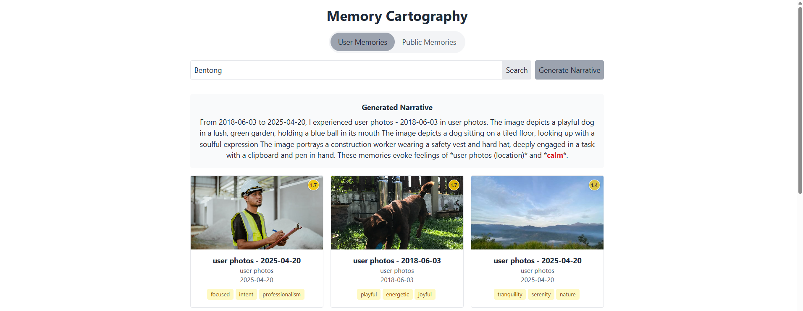

# Memory Cartography, Reimagining Space, Memory, and Identity 🗺️💭

**Author:** Chia Hui Yen  
**Mentor:** Professor Jimmy Cheng   
**Date:** 2025 Spring     

# Architectural Memory Cartography

## Project Overview

Architectural Memory Cartography is an AI-powered spatial recommendation system that analyzes, processes, and recommends architectural spaces using advanced computer vision and natural language processing techniques. The system learns from spatial memories and architectural data to create meaningful connections between spaces, enabling innovative applications in architectural design, analysis, and recommendation.




## Key Features

- **Computer Vision-Based Spatial Analysis**: Extracts architectural features from floor plans and spatial images using ResNet50 and YOLOv8
- **Content-Based Filtering Pipeline**: TF-IDF vectorization and cosine similarity algorithms to compute relationships between spatial configurations
- **Multi-Modal Similarity Detection**: Combines visual and textual information to detect similar architectural elements
- **Spatial Memory Recommendation**: Suggests similar spaces based on architectural characteristics and user preferences
- **Architectural Narrative Generation**: AI-powered system that generates descriptive narratives of architectural spaces
- **Interactive Weight-Based Ranking**: Adaptive recommendation system that evolves based on user interactions

## Technical Architecture

### Full Architecture Overview

```
┌───────────────┐    ┌───────────────┐    ┌───────────────┐    ┌───────────────┐
│ Spatial Data  │───►│Feature Extract│───►│ Vector Store  │───►│  Similarity   │
│ Input (Plans  │    │ (ResNet+YOLO) │    │  (TF-IDF)     │    │  Computation  │
│ & Images)     │    │               │    │               │    │               │
└───────────────┘    └───────────────┘    └───────────────┘    └───────────────┘
                                                                       │
                                                                       ▼
┌───────────────┐    ┌───────────────┐    ┌───────────────┐    ┌───────────────┐
│  Frontend UI  │◄───│  Narrative    │◄───│ Recommendation│◄───│ Spatial Data  │
│ Visualization │    │  Generation   │    │    Engine     │    │   Analysis    │
└───────────────┘    └───────────────┘    └───────────────┘    └───────────────┘
```

### Data Annotation Pipeline

```
┌───────────────┐    ┌───────────────┐    ┌───────────────┐    ┌───────────────┐
│  Floor Plan   │───►│Object Detection│───►│Element Labeling│───►│ Spatial Data  │
│  Input        │    │   (YOLOv8)    │    │   Pipeline    │    │   Validation  │
└───────────────┘    └───────────────┘    └───────────────┘    └───────────────┘
                                                                       │
                                                                       ▼
┌───────────────┐    ┌───────────────┐    ┌───────────────┐    ┌───────────────┐
│ Training Data │◄───│Data Versioning│◄───│  Annotation   │◄───│Quality Control│
│  Generation   │    │    System     │    │  Refinement   │    │     Checks    │
└───────────────┘    └───────────────┘    └───────────────┘    └───────────────┘
```

## Technical Implementation Details

### Architectural Feature Extraction

The system extracts spatial and architectural features through a multi-stage process:

1. **Object Detection**: Utilizes YOLOv8 to identify architectural elements (rooms, doors, windows, furniture)
2. **Feature Embedding**: Employs ResNet50 to generate feature vectors for architectural spaces
3. **Spatial Relationship Analysis**: Analyzes the relationships between different elements within a space
4. **Semantic Vectorization**: Processes architectural descriptions using TF-IDF to capture semantic meaning

```python
# Example of architectural feature extraction from an image
def extract_image_features(self, image_path):
    """Extract feature vector from an image using ResNet50."""
    try:
        if not os.path.exists(image_path):
            print(f"Image not found: {image_path}")
            return None
            
        # Load and preprocess the image
        image = Image.open(image_path).convert("RGB")
        img_tensor = self.transform(image).unsqueeze(0)  # Add batch dimension
        
        # Extract features
        with torch.no_grad():
            features = self.image_model(img_tensor).squeeze(0)
        
        return features.numpy()
    except Exception as e:
        print(f"Error extracting image features: {e}")
        return None
```

### Spatial Similarity Computation

The system uses advanced algorithms to identify similar architectural spaces:

```python
def find_similar_floor_plans(self, query_plan_path, dataset_paths, top_n=5):
    """Find similar floor plans based on visual features."""
    query_features = self.extract_image_features(query_plan_path)
    if query_features is None:
        return []
        
    results = []
    for path in dataset_paths:
        features = self.extract_image_features(path)
        if features is not None:
            # Calculate cosine similarity
            similarity = np.dot(query_features, features) / (
                np.linalg.norm(query_features) * np.linalg.norm(features)
            )
            results.append((path, float(similarity)))
            
    # Sort by similarity (highest first)
    results.sort(key=lambda x: x[1], reverse=True)
    return results[:top_n]
```

### Architectural Data Annotation System

The project implements a comprehensive data annotation system for architectural elements:

```json
{
  "floor_plan_id": "fp_0123",
  "metadata": {
    "title": "Single-Family Home Design",
    "date_annotated": "2024-05-01",
    "annotator": "user_arch_456",
    "source_file": "floor_plan_123.jpg"
  },
  "elements": [
    {
      "element_id": "room_001",
      "type": "room",
      "category": "living",
      "bounding_box": {
        "x1": 120,
        "y1": 230,
        "x2": 450,
        "y2": 380
      },
      "attributes": {
        "area": 24.5,
        "height": 2.8
      }
    },
    {
      "element_id": "door_001",
      "type": "door",
      "bounding_box": {
        "x1": 150,
        "y1": 380,
        "x2": 180,
        "y2": 390
      },
      "attributes": {
        "width": 0.9,
        "door_type": "hinged"
      }
    }
  ],
  "spatial_relationships": [
    {
      "element1": "room_001",
      "element2": "door_001",
      "relation_type": "contains",
      "confidence": 0.95
    }
  ]
}
```

### Architectural Narrative Generation

A unique feature of the system is its ability to generate human-readable descriptions of architectural spaces:

```python
def generate_architectural_narrative(self, floor_plan_data, spatial_memories=None):
    """
    Generate a narrative description of architectural space.
    
    Args:
        floor_plan_data: Data extracted from floor plan analysis
        spatial_memories: Optional related spatial memories
        
    Returns:
        Dict containing narrative and metadata about the architectural space
    """
    # System integrates with GPT-4 to generate rich architectural descriptions
    # or uses a fallback method for simpler descriptions
```

## Applications in Architectural AI

### Floor Plan Analysis and Recommendation

The system can analyze floor plans to extract meaningful architectural features and recommend similar designs:

1. **Element Detection**: Identifies rooms, doors, windows, and structural elements
2. **Spatial Organization Analysis**: Evaluates the arrangement and flow between spaces
3. **Similar Design Recommendation**: Suggests similar floor plans based on spatial organization
4. **Optimization Suggestions**: Provides feedback on improving spatial efficiency

### Architectural Data Annotation Pipeline

The project includes a complete pipeline for architectural data annotation:

1. **Automated Element Detection**: Uses computer vision to detect architectural elements
2. **Annotation Interface**: Tools for refining and validating detected elements
3. **Quality Control**: Checks for annotation consistency and completeness
4. **Dataset Generation**: Creates structured datasets for machine learning training

### Design Feedback and Analysis

The system can provide valuable insights for architectural design:

1. **Spatial Quality Assessment**: Evaluates spatial qualities like flow, light, and proportion
2. **Comparative Analysis**: Compares designs against established patterns and norms
3. **Natural Language Feedback**: Generates readable descriptions and suggestions

## Technology Stack

- **Backend**: FastAPI, SQLite, Python
- **ML Components**: 
  - Feature Extraction: ResNet50
  - Object Detection: YOLOv8
  - Text Vectorization: TF-IDF (scikit-learn)
  - Similarity Computation: Cosine similarity (scikit-learn)
- **Frontend**: React, TypeScript, Tailwind CSS
- **Integration**: OpenAI GPT-4 for narrative synthesis
- **Data Processing**: Pandas, NumPy
- **Image Processing**: PIL, OpenCV

## Future Development Directions

- **Integration with CAD platforms**: Develop plugins for Revit, AutoCAD, and Rhino
- **Advanced ML for spatial understanding**: Train specialized models for architectural element detection
- **Expanded annotation workflows**: Create more robust tools for architectural data labeling
- **Real-time design feedback**: Provide instant feedback during the design process
- **Large-scale architectural dataset**: Build comprehensive datasets of floor plans and spatial configurations

## Conclusion

Architectural Memory Cartography represents a powerful fusion of machine learning, computer vision, and architectural understanding. By creating a system that can analyze, annotate, and recommend spatial configurations, this project demonstrates technical expertise in both AI/ML and architectural domains - making it perfectly aligned with the emerging field of AI in residential construction and architectural design.